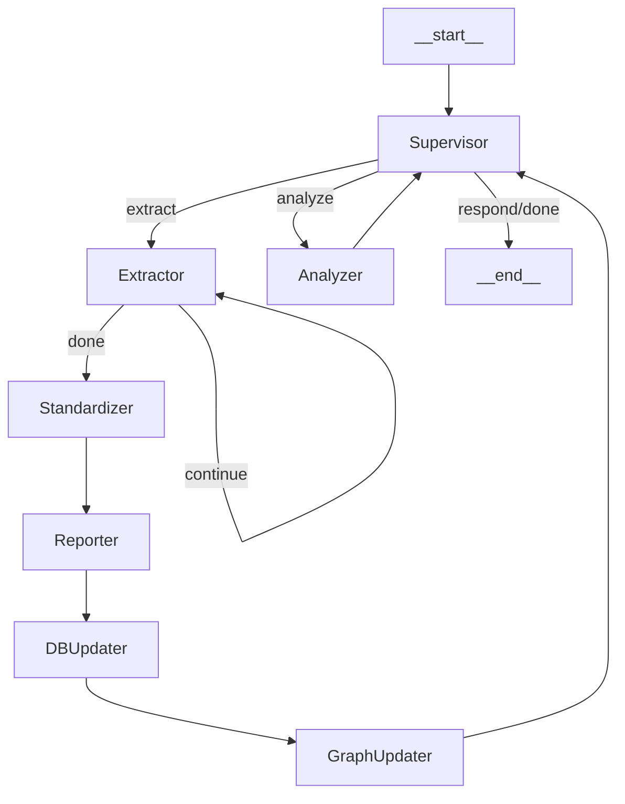

# Feature Mining Agent (FMA)

An autonomous, multi-agent framework built on **LangGraph** to accelerate the discovery of next-generation solid-state electrolytes. This system automates the end-to-end research pipeline—from literature extraction to the **elucidation** of hidden physical descriptors.

---

## Architecture



### Agents

| Agent | Role |
|-------|------|
| **Supervisor** | Orchestrates workflow, interprets user requests, routes to appropriate pipeline |
| **Extractor** | LLM-based extraction of ionic conductivity data from markdown papers |
| **Standardizer** | Unit conversion + vector similarity search for schema mapping |
| **Reporter** | Generates human-readable approval reports |
| **DBUpdater** | Saves standardized data to CSV |
| **GraphUpdater** | Updates Neo4j Knowledge Graph with material-property relationships |
| **Analyzer** | Correlation analysis, data statistics, Neo4j pattern discovery |

---

## Tech Stack

- **Orchestration**: [LangGraph](https://github.com/langchain-ai/langgraph)
- **LLM**: [Ollama](https://ollama.ai/) (local LLM)
- **Framework**: [LangChain](https://github.com/langchain-ai/langchain)
- **Knowledge Graph**: Neo4j
- **Data Processing**: Pandas, SciPy

---

## Project Structure

```text
feature-mining-agent/
├── fma/
│   ├── agents/
│   │   ├── extractor.py      # Paper data extraction
│   │   ├── standardizer.py   # Unit conversion & schema mapping
│   │   ├── reporter.py       # Approval report generation
│   │   ├── db_updater.py     # CSV export
│   │   ├── graph_updater.py  # Neo4j integration
│   │   └── analyzer.py       # Data analysis
│   ├── tools/
│   │   ├── db_tools.py       # CSV query tools
│   │   ├── graph_tools.py    # Neo4j query tools
│   │   └── pipeline_tools.py # Pipeline control tools
│   ├── config.py             # Configuration
│   ├── state.py              # LangGraph state definitions
│   ├── supervisor.py         # Supervisor agent
│   └── graph.py              # Workflow assembly
├── papers/                   # Markdown papers to process
├── runs/                     # Output directory
├── main.py                   # Entry point
└── multi-agent-figure.py     # Graph visualization
```

---

## Getting Started

### 1. Installation

```bash
git clone https://github.com/KSJ-ICMEL/feature-mining-agent.git
cd feature-mining-agent
pip install -r requirements.txt
```

### 2. Configuration

Create a `.env` file:

```env
NEO4J_URI=bolt://localhost:7687
NEO4J_USERNAME=neo4j
NEO4J_PASSWORD=your_password
```

### 3. Usage

**Interactive Mode** (with Supervisor):
```bash
python main.py --interactive
```

**Extraction Only** (batch processing):
```bash
python main.py --use-fma
python main.py --use-fma --md-dir /path/to/papers
```

**Generate Workflow Diagram**:
```bash
python multi-agent-figure.py
```

---

## Example Interaction

```
You: 주어진 논문에서 이온전도도에 영향을 주는 인자들을 추출해줘
Supervisor: 추출을 시작합니다...
  [Extractor] 완료
  [Standardizer] 완료
  [Reporter] 완료
  [DBUpdater] 완료
  [GraphUpdater] 완료
추출이 완료되었습니다. 총 5개의 데이터를 처리했습니다.

You: 구조화된 DB를 바탕으로 이온전도도와 변인 사이 상관관계를 분석해줘
Supervisor: 분석이 완료되었습니다.
| Feature | Correlation | P-value |
|---------|-------------|---------|
| sintering_T | 0.7234 | 0.0021 |
...
```

---

## License

This project is licensed under the MIT License.
