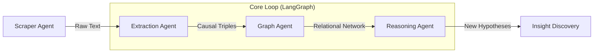

# feature-mining-agent

An autonomous, multi-agent framework built on **LangGraph** to accelerate the discovery of next-generation solid-state electrolytes. This system automates the end-to-end research pipeline—from literature acquisition to the **elucidation** of hidden physical descriptors.

---

## Mission & Vision

The **feature-mining-agent** transcends traditional data extraction by focusing on the **causal logic** embedded in scientific texts. By structuring fragmented research findings into a unified **Knowledge Graph**, the agent identifies latent correlations and predictive factors that govern the **ionic conductivity** of solid-state materials.

### **Key Capabilities**
- **Autonomous Knowledge Acquisition**: Seamlessly collect and filter high-impact literature to stay at the forefront of battery research.
- **Causal Relationship Extraction**: Extract deep mechanisms and "cause-and-effect" relationships (e.g., how specific doping affects lattice strain and conductivity).
- **Knowledge Graph Synthesis**: Transform unstructured PDFs into a structured graph, connecting composition, structure, and property.
- **Latent Feature Discovery**: Mine the graph to uncover hidden predictive factors—acting as a "co-scientist" in the feature engineering process.

---

## Tech Stack

- **Orchestration**: [LangGraph](https://github.com/langchain-ai/langgraph) (for cyclic, stateful agentic workflows)
- **Framework**: [LangChain](https://github.com/langchain-ai/langchain)
- **Storage**: Neo4j (Knowledge Graph) / Vector DB (Context Retrieval)
- **Logic**: Python 3.10+ & Pydantic for structured scientific data parsing

---

## Agentic Workflow



---

## Project Structure

```text
feature-mining-agent/
├── agents/             # Scraper, Extractor, Miner nodes
├── graph/              # Neo4j schema & Cypher query handlers
├── workflows/          # LangGraph state & edge logic
├── data/               # Local cache (Papers, JSONL) - .gitignore applied
├── main.py             # Execution entry point
└── .env                # API Keys & DB Credentials

```

---

## Getting Started

### 1. Environment Setup

```bash
git clone [https://github.com/your-username/feature-mining-agent.git](https://github.com/your-username/feature-mining-agent.git)
cd feature-mining-agent
pip install -r requirements.txt

```

### 2. Configuration

Create a `.env` file:

```env
OPENAI_API_KEY=your_api_key
NEO4J_URI=bolt://localhost:7687
NEO4J_USER=neo4j
NEO4J_PASSWORD=your_password

```

---

## License

This project is licensed under the MIT License.
